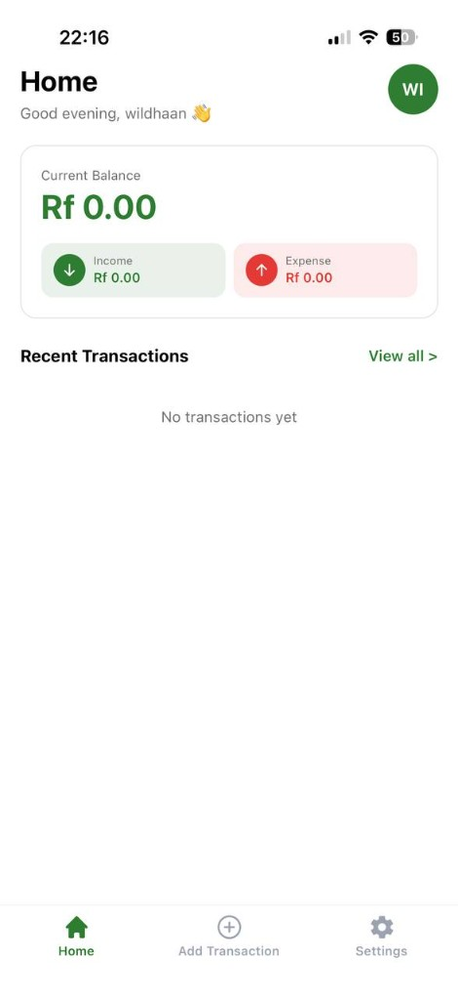
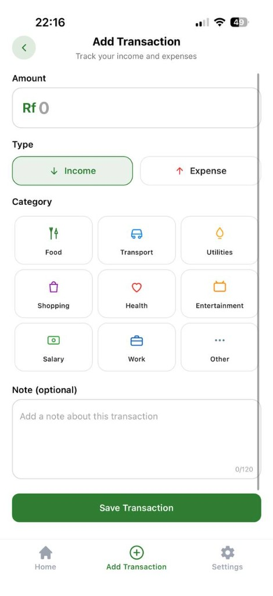
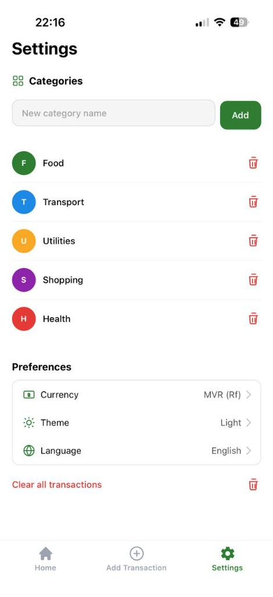
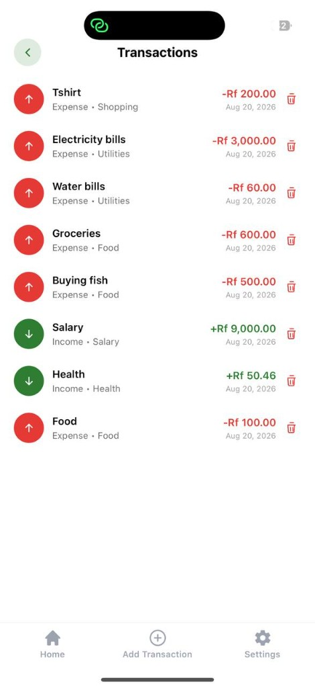

# Personal Finance Tracker

A React Native (Expo) app for tracking income and expenses on your phone. You log transactions locally, see a running balance on the Home dashboard, and manage categories and preferences in Settings.

Data stays on the device via MobX and AsyncStorage. There is no backend. Transactions remain available offline and survive app restarts.

## Features

- **Home dashboard** — current balance, income and expense totals, a time-of-day greeting, the last 5 transactions, and a “View all” link
- **Add transaction** — income or expense toggle, amount, category grid, and an optional note (max 120 characters). The form uses React Hook Form and Zod (amount must be greater than 0)
- **Read / delete** — FlashList on Home and on the full Transactions screen; each row has a delete button with a confirmation prompt
- **Categories** — defaults are Food, Transport, Utilities, Shopping, Health, Entertainment, Salary, Work, and Other. Settings lets you add or remove categories and blocks duplicate names
- **Preferences** — currency (MVR Rf or USD), light / dark / system theme, and English / Arabic. Switching to Arabic asks for an app restart so layout direction can update
- **Persistence** — `FinanceStore` uses `makePersistable` so transactions, categories, and currency survive reload
- **Demo login** — any email and password (6+ characters). The password is not saved on the device. Profile is available from the Home avatar (account details and sign out)
- **Data control** — clear all transactions from Settings

## Tech stack

Expo Router (file-based tabs), MobX, NativeWind (Tailwind CSS), FlashList, React Hook Form, and Zod.

## Screenshots

| Home | Add Transaction | Settings |
| --- | --- | --- |
|  |  |  |

| Transactions |
| --- |
|  |

## Getting started

**Requirements:** Node.js LTS, Yarn 1, [Expo Go](https://expo.dev/go) on your phone.

```bash
cd Personal-Finance-Tracker
yarn install
yarn start
```

Scan the QR code with Expo Go (Android) or the Camera app (iOS). Phone and computer should be on the same Wi-Fi network.

Other commands:

```bash
yarn start --clear   # restart Metro with a clean cache
yarn lint
yarn format
```

Use **Yarn only** in this project (do not mix with npm).

## Project layout

```
src/
├── app/(app)/           # Home, Add Transaction, Settings tabs
├── components/          # transaction form + list item + UI kit
├── stores/              # MobX stores (auth, finance, theme, language)
└── translations/        # en.json, ar.json
```

## License

Private assessment project.
